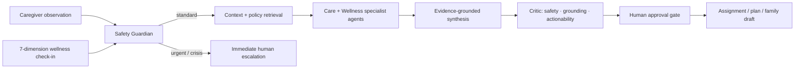

# Aaranya Care Intelligence

**A supervised multi-agent operating system for whole-person senior care.**

[Live prototype](https://aaranya-care-intelligence.trilogy-1207.chatgpt.site/) · [90-second judge flow](#90-second-judge-flow) · [Evaluation evidence](#measurable-quality) · [Architecture](docs/ARCHITECTURE.md)

Senior-living teams capture important observations, coordinate follow-up and reassure families across fragmented notes, calls and chat groups. Aaranya turns one caregiver observation into an inspectable, policy-grounded workflow—then adds a seven-dimension **WholeLife Pulse** so teams can see the person behind the alert.

> Decision support, not diagnosis. Every assignment, wellness plan and family message remains held until a human approves it.

## Why this can win

| Judge question | Aaranya's answer |
|---|---|
| Is the problem painful? | Care teams lose time and context while families wait for answers. |
| Is the product differentiated? | Operational care orchestration and holistic wellness intelligence share one auditable workflow. |
| Is the AI genuinely agentic? | Bounded specialist agents retrieve context, check policy, synthesise actions, critique output and request human approval. |
| Is it safe? | Acute-risk signals stop normal planning; outbound actions are held; every decision has a deterministic trace. |
| Is it more than a mock-up? | The repository includes typed runtimes, interactive workflows, 37 tests and a 350-check evaluation harness. |
| Can it become a business? | The 90-day operator pilot targets response time, documentation quality, family turnaround and staff adoption. |

## The product

- **Shift Command** prioritises the residents who need a decision.
- **Care Council** runs five bounded agents for memory, coordination, safety, operations and family communication.
- **WholeLife Pulse** synthesises sleep, energy, stress, movement, nourishment, connection and purpose into explainable support priorities.
- **Safety Guardian** detects urgent physical and self-harm language, pauses lifestyle suggestions and routes to human help.
- **Evidence + Critic** attach stable evidence identifiers and verify safety, grounding and actionability before release.
- **Human Steward** keeps assignments, plans and family updates in an explicit approval state.

## 90-second judge flow

1. Open the [live prototype](https://aaranya-care-intelligence.trilogy-1207.chatgpt.site/) and select **Anita Menon**.
2. Inspect her seven-dimension **WholeLife Pulse**, evidence cards and supervised agent stages.
3. Choose **Low food intake** and follow the care decision from observation to owner.
4. Approve the assignment and generate a factual family update; notice that outbound release is still held.
5. Choose **Chest pain** to see the safety-first escalation path override the normal workflow.

## Architecture



The prototype is deliberately deterministic so every result is reproducible. Its typed contracts are designed to accept model-backed planners, durable orchestration and observability without weakening the safety boundary. See [the architecture note](docs/ARCHITECTURE.md).

## Measurable quality

```bash
npm test       # 37 automated tests
npm run eval   # 30 scenarios, 350 contract checks, target >= 9.9/10
npm run lint
npm run build
```

The evaluation suite covers care routing, wellness synthesis, evidence grounding, deterministic traces, approval gates, emergency escalation, self-harm language, negation, prompt injection, Unicode controls and extreme numeric inputs. The command exits non-zero below the 9.9 threshold. See [the evaluation methodology](docs/EVALUATION.md).

## Honest pilot scorecard

These are validation targets—not traction claims:

- 30% lower observation-to-owner time versus the week-one baseline.
- At least 95% required-field completion for escalated notes.
- Under 30 minutes median turnaround for an approved family update.
- At least 80% weekly adoption among invited pilot staff.

## Run locally

```bash
npm ci
npm run dev
```

Open `http://localhost:3000`. No API key, resident data or external service is required.

## Repository map

```text
app/                         Interactive operator experience
lib/care-agent.ts            Safety-aware care recommendation contract
lib/agent-orchestrator.ts    Five-agent care workflow and tool trace
lib/wellness-engine.ts       Seven-dimension WholeLife analysis
lib/wellness-agent-runtime.ts Six-stage evidence and approval runtime
tests/                       Unit, safety and adversarial tests
evals/                       Reproducible 350-check quality harness
docs/                        Architecture and evaluation evidence
```

## Responsible boundary

Aaranya is a prototype for care coordination and wellness support. It does not diagnose, prescribe, alter treatment or contact emergency services. All records and policy cards are synthetic. A production deployment requires qualified clinical governance, privacy and consent controls, jurisdiction-specific escalation, monitored model serving, accessibility testing and real-world validation with care teams and residents.

